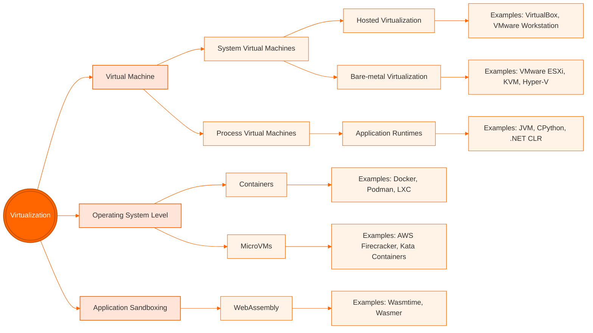

# Virtualization

!!! note "Learning Outcomes"
    - Gain a fundamental understanding of virtualization concepts.
    - Define and distinguish between different types of Virtual Machines (VMs).
    - Understand the role and types of Hypervisors (Type 1 and Type 2).
    - Understand the transition from traditional VM-based virtualization to lightweight containerization.

Virtualization is a cornerstone technology that enabled the cloud revolution. It provides the basic underlying principles for the development and adoption of cloud computing by allowing physical hardware to be partitioned into multiple virtual resources. While the concept is not new and was used in the early days of computing, modern virtualization has been exploited to lead to significantly better utilization of server resources in data centers and on local desktops.

Virtualization enables the execution of multiple isolated environments on a single piece of physical hardware, making it appear as if each application or operating system is running on its own independent computer. This allows multiple applications to run independently from each other in their own virtualized context.

Examples of the usefulness of virtualization include testing applications and running experiments on an operating system different from the one on the host computer. To enable this, we use virtual machines.

However, it is important to note that the search popularity of hypervisors has been decreasing, as other lightweight virtualization solutions, i.e., container technologies, are now more mainstream. We will cover them in a different chapter.

## Virtual Machines

A **Virtual Machine (VM)** is a software-based emulation of a computer system. This can include process virtualization and physical computer virtualization, such as running an operating system. Multiple virtual machines share the resources of the computer or system on which they run.

We distinguish between two primary types of virtual machines:

### 1. System Virtual Machines (Hardware VMs)
System VMs provide a complete emulation of the underlying hardware, providing a complete system platform environment that allows a full "guest" operating system to run. The hypervisor abstracts the physical CPU, memory, and I/O devices.

*   **How it works**: We essentially run another operating system on top of the existing OS (or hardware) while using a software abstraction between them.
*   **Examples**: Oracle VirtualBox, VMware Workstation, Microsoft Hyper-V.

### 2. Process Virtual Machines (Application VMs)
Process VMs provide a platform-independent programming environment designed to execute a single program. They abstract the details of the underlying hardware or OS from software or application runtime to ensure the application runs identically regardless of the host platform.

*   **Examples**: Java Virtual Machine (JVM), CPython,  and the .NET Framework / Common Language Runtime (CLR).

#### Contrast: Wine (Wine is not an emulator)
**Wine** (*Wine Is Not an Emulator*) is not a hypervisor or a virtual machine. Instead, it provides a **compatibility layer** that translates Windows API calls into POSIX calls in real-time. This allows Windows applications to run on Linux, macOS, and BSD with near-native performance, without the overhead of a full guest operating system.

#### Contrast: Python Virtual Environments vs. Virtual Machines

It is important to distinguish between a Python Virtual Environment (venv) and a Virtual Machine (VM). While both use the term "virtual," they operate at completely different levels of computing.

* **Python venv is Not Virtualization**: A Python venv is a filesystem isolation tool for dependency management. It does not isolate running processes, system resources, or hardware.
* **Key Differences**

    * No Process Isolation: Scripts in a venv use the host operating system's standard process management. They have full access to the host's system resources, files, and other running processes.
    * Path Manipulation Only: A venv works entirely by altering environment variables like PATH and VIRTUAL_ENV. This simply redirects the terminal to look inside a specific folder for the Python executable and its libraries.
    * Shared Kernel: Unlike Virtual Machines or Docker containers, a venv provides no isolation for the operating system kernel, network stacks, or user IDs.

| Feature | Python Virtual Environment (`venv`) | Virtual Machine (VM) |
| :--- | :--- | :--- |
| **What is virtualized?** | The Python runtime and installed packages. | The entire physical hardware (CPU, RAM, Disk). |
| **Isolation Level** | **Dependency Isolation**: Prevents package version conflicts between projects. | **System Isolation**: Runs a complete guest OS isolated from the host OS. |
| **Overhead** | Negligible (just a directory with symlinks/copies). | High (requires memory and CPU for a full OS). |
| **Boot Time** | Instant (just activating a script). | Minutes (booting a full kernel). |
| **Use Case** | Managing different library versions for different Python projects. | Running a different OS or isolating an entire system. |

---

## System Virtualization and Hypervisors

System virtualization is the primary engine behind Infrastructure-as-a-Service (IaaS). The software layer that creates and runs virtual machines is called the **Virtual Machine Monitor (VMM)** or, more commonly, the **Hypervisor**.

!!! info "Virtual Machine Monitor (VMM)" 
    The **Virtual Machine Monitor (VMM)** is the software layer that abstracts physical hardware to create and manage virtual machines; this layer is more commonly referred to as the **Hypervisor**.

There are two primary architectures for hypervisors:

### Type 1: Bare-Metal Hypervisors

A Type 1 hypervisor is installed directly on top of the physical hardware, so that it has direct access to the underlying hardware. It hosts the operating system. 

*    **Role**: It acts as the operating system for the hardware, managing the guest VMs.
*   **Key Characteristic**: No underlying host OS is required.
*   **Common Use Case**: Enterprise data centers and cloud environments.
*   **Examples**: 
    *   **VMware ESXi**: Widely used in enterprise data centers for server consolidation.
    *   **Microsoft Hyper-V**: Integrated into Windows Server and used extensively in Azure cloud.
    *   **Xen**: An open-source hypervisor used by many early cloud providers (including AWS in its early stages).

!!! info "Type-1 hypervisors" 
    Type-1 hypervisors support native or bare-metal installations. They run
    directly on the host's hardware to control the hardware and to
    manage guest operating systems.

  
Virtual machines

  
  <!-- VMs Row -->
  

    

      
VM1

      
App

      
Guest OS

    

    

      
VM2

      
App

      
Guest OS

    

    

      
VM3

      
App

      
Guest OS

    

  

  <!-- Hypervisor -->
  

    Hypervisor
  

  <!-- Host Hardware -->
  

    Host hardware
  

 

 Figure. Type 1 (Bare-metal) Virtualization 

### Type 2: Hosted Hypervisors

In hosted virtualization, the base operating system is installed on the hardware first. Here, a virtual machine monitor (VMM) is installed on top of the host OS, allowing the users to run other operating systems on the VMM. In addition, the Hypervisor manages the deployment of potentially multiple virtual machines on top of the underlying operating system.

*   **Role**: It is easier to install and use for development and testing on a personal computer.
*   **Key Characteristic**: Runs as an application within a host OS.
*   **Common Use Case**: Local development, testing, and personal use on desktops.
*   **Examples**: 
    *   **Oracle VirtualBox**: A free and open-source hypervisor popular for local development and cross-platform testing.
    *   **VMware Workstation**: A professional-grade hosted hypervisor used by developers and IT professionals.
    *   **QEMU**: A generic and open-source machine emulator and virtualizer often used in combination with KVM.

!!! info "Type-2 hypervisors"
    Type-2 hypervisors are supporting hosted virtualization. They run on a
    conventional operating system (OS), just as other computer programs
    do. A guest operating system runs as a process on the host.

  
Virtual machines

  
  <!-- VMs Row -->
  

    

      
VM1

      
App

      
Guest OS

    

    

      
VM2

      
App

      
Guest OS

    

    

      
VM3

      
App

      
Guest OS

    

  

  <!-- Hypervisor -->
  

    Hypervisor
  

  <!-- Host OS -->
  

    Host operating system
  

  <!-- Host Hardware -->
  

    Host hardware
  

 
Figure. Type 2 (Hosted) Virtualization
 

### Comparison 

In either case, the functionality of a virtual machine is supported through configuration files, system specifications, and access to physical resources—either directly or indirectly through the host OS. A virtual machine provides the same functionality as a physical computer, but with the distinct advantages of hardware independence, enhanced security, and superior resource utilization.

The following table summarizes the key differences, advantages, and disadvantages of Type 1 and Type 2 hypervisors.

| Feature | Type 1 (Bare-Metal) | Type 2 (Hosted) |
| :--- | :--- | :--- |
| **Installation** | Directly on hardware | On top of a Host OS |
| **Performance** | High (near-native) | Lower (overhead from Host OS) |
| **Efficiency** | Very high (direct resource access) | Moderate (resources managed by Host OS) |
| **Stability** | Higher (less software layers) | Lower (depends on Host OS stability) |
| **Ease of Setup** | Complex (requires dedicated hardware) | Simple (installed like any application) |
| **Typical Use Case** | Production servers, Enterprise Cloud | Development, Testing, Personal use |
| **Advantages** | • Maximum performance   • Scalability   • Robust security | • Easy installation   • Better hardware compatibility   • Familiar interface |
| **Disadvantages** | • Steeper learning curve   • Restricted hardware support | • Performance overhead   • Dependence on Host OS |

To give some more details.

Advantages of Hosted Virtualization include

* Multiple Operating systems run on separate virtual machines on a VMM.
* Different Operating systems run on separate virtual machines on a VMM.
* Hardware-level driver support is controlled by VMM, allowing an
  isolation of certain security aspects for accessing the hardware.
* Installation of software can be done by the owner of the virtual
  machine and does not have to be conducted by the provider of the
  hypervisor.

Disadvantages of Hosted Virtualization include

* Increased resource requirements as the Guest OS is running a full
  copy of the OS. In its worst case, this will lead to a significant performance reduction while using resources that are in contention.
* The user of hypervisors must be familiar with the operating system
   management and security to ensure it is safe to use.

## Virtualization Approaches

Next, we look at different virtualization approaches that relate to
resource utilization.

### Full virtualization

When looking at virtualization, we often identify it with being full
virtualization. The **hypervisor provides a full abstraction of the
hardware** exposed to the guest OSs. In this case, the guest OSs the
virtual machine just run without any special modification on the host
OS. It just looks like an independent running computer
[@paravsfull-virt].

### Paravirtualization

Para -- alongside/partial -- virtualization is developed to improve
performance by interacting between the OS and the hypervisor. This is
done for complex and time-consuming tasks that otherwise could not be
managed by the VMM manager. Commands sent from the OS to the
hypervisor are called *hypercalls*.

## Practical Virtualization

In practice, we often use hosted hypervisors to simulate cloud resources on a local desktop without incurring costs. 

### VirtualBox and Automation
One of the most common tools for this is **Oracle VirtualBox**. To make the use of VirtualBox more convenient and reproducible, we find command-line tools such as **Vagrant**, which allow us to define and launch virtual machines using a simple configuration file instead of utilizing the GUI or complex command interfaces.

To improve the interaction between the host and the guest, a **guest additions package** is typically installed. This allows for features like shared folders, shared clipboards, and better window management between the host and guest OS.

In Section [VirtualBox](../../section/cloud/local/virtualbox.md) we have provided a practical introduction to VirtualBox.

---
<!--
](images/kvm-xen-hyperv-gtrends.png){#fig:hypervisor-gtrends}
-->

## Technical Nuances and Advanced Comparisons

### QEMU, KVM, and Xen
Beyond the basic types, there are specialized implementations:
*   **QEMU and KVM**: These are better integrated into Linux and have a smaller footprint, which may result in better performance.
*   **VirtualBox**: Targeted as general-purpose virtualization software, primarily limited to x86 and amd64 architectures.
*   **Xen**: Uses QEMU to allow hardware virtualization; however, Xen can also use paravirtualization [@diff-qemu].

### Full vs. Paravirtualization
In the following table, we summarize support for full- and paravirtualization across popular technologies.

|     | XEN | KVM | VirtualBox | VMware |
| --- | ---: | ---: | ---: | ---: |
| Paravirtualization | Yes | Yes (via virtio) | Yes | Yes |
| Full virtualization | Yes | Yes | Yes | Yes |

---

## Beyond Compute Virtualization

Virtualization is not limited to the CPU and Operating System. The same principle of abstracting physical hardware into logical resources applies to other infrastructure components.

### Storage Virtualization
Storage virtualization allows the system to integrate the logical view of the physical storage resources into a single pool of storage. Users are unaware that their data is not hosted on a single physical disk. This is achieved across various layers: Storage devices, the Block aggregation layer, the File/record layer, and the Application layer. 

Good examples of cloud-based virtual storage include **Google Drive**, as well as services like **Dropbox, AWS S3, and Azure Blob Storage**.

### Network Virtualization
Network virtualization combines hardware and software network resources into a single, software-defined administrative unit called a **virtual network**. 

We distinguish between:
*   **External network virtualization**: Combines many physical networks into a unifying logical network.
*   **Internal network virtualization**: Provides network functionality to the processes and containers running on a single server.

Note that we will not cover this topic in depth in this introductory class, but students are encouraged to contribute sections or chapters on this topic.

---

## Exercises

!!! note "E.Virtualization.1"
    Install a virtualization framework on your local machine and experiment with it.

!!! note "E.Virtualization.2"
    Contribute a section about network virtualization.

!!! note "E.Virtualization.3"
    Which free virtualization software did you install on your machine? Can you describe your experience with it?

    |  |  |  |  |  |
    |---------------|---------------|---------------|---------------|---------------|
    | **Feature** | **Parallels (Mac)** | **VMware (Win/Lin/Mac)** | **UTM (Mac)** | **VirtualBox (All)** |
    | **Cost** | Paid (Subscription) | **Free** (Personal Use) | Free | Free |
    | **Setup Ease** | Easiest (1-Click) | Moderate | Simple | Manual |
    | **Performance** | Best on M-series | Excellent | Near-Native (ARM) | Moderate |
    | **3D Graphics** | Best (DX11/12) | Great (DX11) | None / Basic | Moderate |

!!! note "E.Virtualization.4"
    Start a recent LTS version of an Ubuntu image on your virtualizer.
    - Which version did you use?
    - Did it work?
    - Describe what limitations you set based on your machine's hardware resources?

!!! note "E.Virtualization.5"
    Automate the management of your virtual machines with a Makefile with the following set of minimal targets:
    - make help
    - make start
    - make stop
    - make status
    - make pause
    - make resume
    - make destroy
    - make backup
    - make recover # reloads from a backup

    Why would one create such a makefile, instead of just using the GUI (if yours has one)?
    You are allowed to use an LLM to help you. However, you need to explore what it creates and understand each line of the program.

!!! note "E.Virtualization.6"
    Based on your experience with E.Virtualization.5 develop a python program that can accept commandline arguments with additional parameters such as:
    - vm-manager.py help
    - vm-manager.py set --name=NAME –os=Ubuntu24_LTS_64
    - vm-manager.py start [--name=NAME] ...
    - vm-manager.py stop [--name=NAME] ...
    - vm-manager.py status [--name=NAME]
    - vm-manager.py pause [--name=NAME]
    - vm-manager.py resume [--name=NAME]
    - vm-manager.py destroy [--name=NAME]
    - vm-manager.py backup [--name=NAME]
    - vm-manager.py recover [--name=NAME] # reloads from a backup
    - vm-manager.py list # lists the vms in a table including space requirements and memory utilization if possible
    - vm-manager.py images # lists the os's available (probe dynamically if possible)

    1. Can your program handle multiple virtual machines by name?
    2. Assume the set command saves the name of the vm and if the --name option is omitted this name is used. If you need a configuration file you must use YAML. Name it ~/.cloudmesh/vms.yaml.
    3. You are allowed to use an LLM to help you. However, you need to explore what it creates and understand each line of the program.
    4. How do you handle security groups and ssh keys (Not covered in previous assignment).
    5. Show that you can login.

!!! note "E.Virtualization.7"
    Develop unit tests for E.Virtualization.6

## Appendix - Contrasting Containers

We will not explain this in great detail here, as we will discuss it more extensively in a different document. But it is worthwhile to have a figure that can contrast containers to the virtual machines.

### Comparisons to Containers

!!! info "Definition Container"

    From an operating system perspective, **a container is an isolated, resource-controlled user space process running on a shared host kernel.** It uses native OS features (like Linux namespaces and cgroups) to restrict what the process can see and use, creating the illusion of a dedicated operating system. 
    
    Key Characteristics:

    * **Lightweight:** Shares the host OS kernel instead of virtualizing hardware.
    * **Standalone:** Includes everything needed to run (code, runtime, system tools, libraries).
    * **Immutable:** Built from a read-only image, ensuring it runs identically everywhere. Here is a short comparison highlighting how they isolate environments.

    Comparison:
    
    * **Virtualization Level:** Hypervisors virtualize hardware to run multiple full operating systems. Containers virtualize the operating system to run isolated user spaces.
    * **Guest OS:** Hypervisors require a full guest OS for every virtual machine. Containers share the host OS kernel and only include application dependencies.
    * **Performance & Speed:** Hypervisors have higher overhead and take minutes to boot. Containers are lightweight, start in seconds, and use fewer system resources.
    * **Security Isolation:** Hypervisors provide stronger isolation because VMs do not share a kernel. Containers have weaker isolation; a kernel vulnerability can endanger the host.

!!! info "NIST Definition"

    **Application container:** "A method for packaging and securely running an application within an application virtualization environment." [[1]](https://csrc.nist.gov/glossary/term/container)

    **Application container:** "Application container technologies, also known as containers, are a form of operating system virtualization combined with application software packaging. Containers provide a portable, reusable, and automatable way to package and run applications." [[2]](https://www.nist.gov/publications/application-container-security-guide)

  
Containers

  
  <!-- Containers Row -->
  

    

      
Container 1

      
App

      
Bins/Libs

    

    

      
Container 2

      
App

      
Bins/Libs

    

    

      
Container 3

      
App

      
Bins/Libs

    

  

  <!-- Docker Engine -->
  

    Docker Engine
  

  <!-- Host OS -->
  

    Host OS
  

  <!-- Host Hardware -->
  

    Host hardware
  

